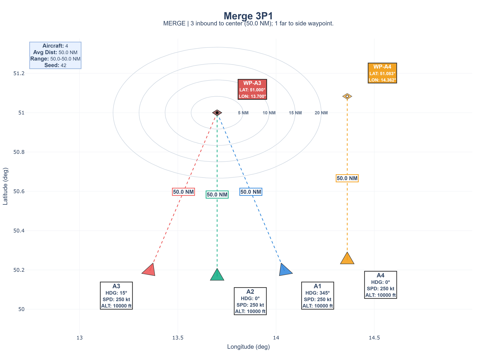

# ATC Hallucination Detection Project

**Simulation and Quantification of ML-Based Hallucination Effects on Safety Margins in En Route Control**

> Master's Thesis Project - Air Transport and Logistics  
> Technical University Dresden  
> Author: Somnath Panigrahi

---

## 🎯 Project Overview

This project investigates **hallucination phenomena** in Multi-Agent Reinforcement Learning (MARL) systems applied to air traffic collision avoidance. Hallucinations manifest as:

- **False Alerts (Ghost Conflicts)**: AI predicts conflicts that don't exist, causing unnecessary interventions
- **Missed Conflicts (Invisible Threats)**: AI fails to detect actual collision risks, compromising safety

Using BlueSky air traffic simulation and Ray/RLlib training infrastructure, we train cooperative collision avoidance policies and systematically test their robustness under distribution shifts. Real-time hallucination detection compares ground truth conflict predictions (TCPA/DCPA) against policy action patterns to quantify safety degradation.

### Research Questions

1. **How do distribution shifts affect hallucination rates in trained MARL policies?**
2. **What is the relationship between false alerts and missed conflicts under operational stress?**
3. **Can survival analysis quantify safety margin reliability across scenarios?**
4. **Which shift categories (speed, position, aircraft type) cause the most severe degradation?**

---

## 📊 Methodology Overview


### Training Phase
1. **Scenario Generator** creates standardized conflict geometries (head-on, parallel, converging, t-formation, canonical crossing)
2. **BlueSky Environment** simulates realistic aircraft dynamics with 18-dimensional relative observations
3. **MARL Training** uses PPO/SAC/IMPALA with shared policies and team-based reward shaping
4. **Model Checkpointing** saves best-performing policies for evaluation

### Testing Phase
5. **Distribution Shifts** apply targeted perturbations (speed, position, heading, aircraft type, waypoint)
6. **Baseline vs Shift Testing** compares performance on training scenario vs cross-scenario generalization
7. **Hallucination Detection** identifies false alerts and missed conflicts in real-time
8. **Survival Analysis** quantifies episode-level minimum separation reliability

---

## 🚀 Quick Start

### Installation

```bash
# Clone repository
git clone https://github.com/Somnathab3/ATC_Hallucination.git
cd ATC_Hallucination

# Install dependencies (Python 3.8-3.10 recommended)
pip install -r requirements.txt

# Install PyTorch with CUDA (optional, for GPU training)
pip install torch>=2.0.0 torchvision torchaudio --index-url https://download.pytorch.org/whl/cu121
```

### Complete Pipeline Example

```bash
# 1. Generate conflict scenarios
python atc_cli.py generate-scenarios --all

# 2. Train MARL model (50k timesteps, ~30 min on GPU)
python atc_cli.py train --scenario head_on --algo PPO --timesteps 50000 --gpu

# 3. Test robustness with distribution shifts (100 episodes per shift)
python atc_cli.py test-shifts --targeted --episodes 100 --viz

# 4. Generate survival analysis and bundle reports
python src/analysis/survival_curve_analysis.py --data_dir results_baseline_vs_shift --output survival_analysis
python src/analysis/shift_bundle_analysis.py --data_dir results_baseline_vs_shift --output bundle_analysis

# 5. View interactive visualizations
# Open: results_baseline_vs_shift/scenario_centric_visualizations/master_scenario_analysis_index.html
```

### CLI Quick Reference

```bash
# List available resources
python atc_cli.py list scenarios
python atc_cli.py list checkpoints
python atc_cli.py list results

# Full end-to-end pipeline (single command)
python atc_cli.py full-pipeline --scenario head_on --train-timesteps 50000 --test-episodes 100
```

---

## 📐 Scenario Visualizations

Our standardized scenarios create inevitable conflicts without intervention, testing both scenario-specific and generic trained models.

### Initial Scenario Geometries

All scenario visualizations are available in `docs/scenario_plots/`.

<table>
<tr>
<td align="center"><b>Chase 2x2</b><br><a href="docs/scenario_plots/chase_2x2_radar.html"></a><br>2 chase pairs<br><a href="docs/scenario_plots/chase_2x2_radar.html">Interactive Plot</a></td>
<td align="center"><b>Chase 3+1</b><br><a href="docs/scenario_plots/chase_3p1_radar.html"></a><br>3 chase + 1 crossing<br><a href="docs/scenario_plots/chase_3p1_radar.html">Interactive Plot</a></td>
<td align="center"><b>Chase 4-All</b><br><a href="docs/scenario_plots/chase_4all_radar.html"></a><br>4-way chase<br><a href="docs/scenario_plots/chase_4all_radar.html">Interactive Plot</a></td>
</tr>
<tr>
<td align="center"><b>Cross 2x2</b><br><a href="docs/scenario_plots/cross_2x2_radar.html"></a><br>2 crossing pairs<br><a href="docs/scenario_plots/cross_2x2_radar.html">Interactive Plot</a></td>
<td align="center"><b>Cross 3+1</b><br><a href="docs/scenario_plots/cross_3p1_radar.html"></a><br>3 crossing + 1 parallel<br><a href="docs/scenario_plots/cross_3p1_radar.html">Interactive Plot</a></td>
<td align="center"><b>Cross 4-All</b><br><a href="docs/scenario_plots/cross_4all_radar.html"></a><br>4-way crossing<br><a href="docs/scenario_plots/cross_4all_radar.html">Interactive Plot</a></td>
</tr>
<tr>
<td align="center"><b>Merge 2x2</b><br><a href="docs/scenario_plots/merge_2x2_radar.html"></a><br>2 merging pairs<br><a href="docs/scenario_plots/merge_2x2_radar.html">Interactive Plot</a></td>
<td align="center"><b>Merge 3+1</b><br><a href="docs/scenario_plots/merge_3p1_radar.html"></a><br>3 merging + 1 crossing<br><a href="docs/scenario_plots/merge_3p1_radar.html">Interactive Plot</a></td>
<td align="center"><b>Merge 4-All</b><br><a href="docs/scenario_plots/merge_4all_radar.html"></a><br>4-way merge<br><a href="docs/scenario_plots/merge_4all_radar.html">Interactive Plot</a></td>
</tr>
</table>

**Key Features:**
- Centered at 51.0°N, 13.7°E (Dresden, Germany airspace)
- FL100 altitude, 250kt cruise speed
- "FIXED" distances ensure episode convergence within 100 steps (1000 seconds)
- Three conflict geometries (chase, cross, merge) with three complexity levels (2x2, 3+1, 4-all)

### Trained Policy Baseline Performance

The following visualizations show trained PPO models executing their baseline scenarios (trained and tested on same scenario):

#### Chase Scenarios
<table>
<tr>
<td align="center"><b>Chase 2x2 Baseline</b><br><br><i>Model: PPO_chase_2x2_20251008_015945</i></td>
<td align="center"><b>Chase 3+1 Baseline</b><br><br><i>Model: PPO_chase_3p1_20251008_015936</i></td>
<td align="center"><b>Chase 4-All Baseline</b><br><br><i>Model: PPO_chase_4all_20251008_015933</i></td>
</tr>
</table>

#### Cross Scenarios
<table>
<tr>
<td align="center"><b>Cross 2x2 Baseline</b><br><br><i>Model: PPO_cross_2x2_20251008_050349</i></td>
<td align="center"><b>Cross 3+1 Baseline</b><br><br><i>Model: PPO_cross_3p1_20251008_055141</i></td>
<td align="center"><b>Cross 4-All Baseline</b><br><br><i>Model: PPO_cross_4all_20251008_053820</i></td>
</tr>
</table>

#### Merge Scenarios
<table>
<tr>
<td align="center"><b>Merge 2x2 Baseline</b><br><br><i>Model: PPO_merge_2x2_20251008_170616</i></td>
<td align="center"><b>Merge 3+1 Baseline</b><br><br><i>Model: PPO_merge_3p1_20251008_192721</i></td>
<td align="center"><b>Merge 4-All Baseline</b><br><br><i>Model: PPO_merge_4all_20251009_024636</i></td>
</tr>
</table>

### Inter-Scenario Transfer Failures

When models encounter unfamiliar conflict geometries, catastrophic failures occur. These examples show the **Cross 3+1** model (trained on crossing conflicts) attempting various chase scenarios:

<table>
<tr>
<td align="center"><b>Cross 3+1 → Chase 4-All</b><br><br><i>Complete breakdown: crossing strategy fails in chase geometry</i></td>
<td align="center"><b>Cross 3+1 → Cross 2x2</b><br><br><i>Complexity mismatch: 3+1 model struggles with simpler 2x2</i></td>
<td align="center"><b>Cross 3+1 → Cross 4-All</b><br><br><i>Scale-up challenge: 3+1 coordination breaks in 4-all complexity</i></td>
</tr>
</table>

**Key Observations:**
- 🔴 **Geometry mismatch** (Cross→Chase): Model applies perpendicular avoidance maneuvers to in-trail conflicts, causing collisions
- 🟠 **Complexity transfer** (3+1→2x2): Overtrained policies exhibit excessive caution in simpler scenarios
- 🟡 **Scale-up failure** (3+1→4-all): Coordination strategies collapse with additional agents

*More inter-shift examples: [docs/Visualisation_GIF/Inter_shift_Visualisation/](docs/Visualisation_GIF/Inter_shift_Visualisation/)*

**Generating Baseline Visualizations:**
```bash
# Run all baseline visualizations automatically
python run_baseline_visualizations.py --episodes 3 --fps 8

# Preview commands without execution
python run_baseline_visualizations.py --dry-run

# Quick execution without GIF recording
python run_baseline_visualizations.py --no-record-gifs

# Custom settings
python run_baseline_visualizations.py --episodes 5 --fps 10
```

**Output locations:**
- GIF visualizations: `docs/Visualisation_GIF/Trained_Viz_Baseline/`
- Trajectory CSVs: `vis_results/`
- Execution summary: `docs/Visualisation_GIF/Trained_Viz_Baseline/baseline_visualization_results.json`

---

## 📈 Key Results: Cross-Scenario Reliability Analysis

Our comprehensive analysis reveals critical insights into MARL policy robustness under distribution shifts through both **deterministic** (2 episodes per test) and **stochastic** (100 episodes per test) evaluation protocols.

### Inter-Scenario Transfer Matrix (Deterministic)

**Deterministic testing** (2 episodes) provides rapid assessment of worst-case cross-scenario performance:

<p align="center">

<br>
<b>Figure: Inter-Scenario LoS Risk Matrix (Deterministic)</b> - Loss of Separation probability when models trained on one scenario (rows) are tested on different scenarios (columns). Darker colors indicate higher collision risk.
</p>

**Key Observations:**
- **Diagonal dominance**: Models achieve near-zero LoS on training scenarios (chase_2x2→chase_2x2: 0%, cross_3p1→cross_3p1: 0%)
- **Cross-geometry failure**: Chase-trained models achieve 100% LoS on cross/merge scenarios; vice versa
- **Generic model struggles**: Trained on mixed traffic, achieves 50-100% LoS across all test scenarios
- **Complexity gradient**: Within-family transfers (chase_2x2→chase_3p1) show moderate degradation (0% → 50%)

*Full deterministic results: [docs/survival_analysis/Intershift_determinsitic_survival_analysis/](docs/survival_analysis/Intershift_determinsitic_survival_analysis/)*

---

### Intra-Scenario Distribution Shifts (Stochastic)

**Stochastic testing** (100 episodes) quantifies robustness to operational variability through targeted agent perturbations:

<p align="center">

<br>
<b>Figure: Intra-Scenario Hallucination Detection F1 Scores</b> - Performance degradation when single agents experience speed, heading, position, aircraft type, or waypoint shifts. Higher F1 indicates better conflict prediction accuracy.
</p>

**Shift Category Analysis:**

| Shift Type | Severity Range | Impact on F1 | Representative Cases |
|------------|----------------|--------------|----------------------|
| **Speed** | ±5 to ±35 kt | 📉 0.85 → 0.05 | Linear degradation beyond ±15 kt |
| **Heading** | ±5° to ±35° | 📊 0.82 → 0.03 | Catastrophic failure at ±20°+ (U-shaped risk curve) |
| **Position** | 0.05 to 0.4 NM | 📈 0.15 → 0.48 | Gradual decline with increased displacement |
| **Aircraft Type** | B738 ↔ A320 | ⚠️ Variable | Depends on performance delta (speed/climb rate) |
| **Waypoint** | Sequential shifts | 🔄 0.60 → 0.25 | Route-dependent sensitivity |

**Critical Thresholds:**
- **Speed shifts**: F1 < 0.5 beyond ±20 kt (8% of cruise speed)
- **Heading shifts**: F1 < 0.1 beyond ±15° (complete spatial confusion)
- **Position shifts**: F1 remains > 0.3 even at 0.4 NM (spatial robustness)

*Full stochastic results: [docs/survival_analysis/Intershift_Stochastic_Survival_analysis/](docs/survival_analysis/Intershift_Stochastic_Survival_analysis/)*

---

### Statistical Summary: Baseline vs Shift Performance

**Deterministic Cross-Scenario Transfer (2 episodes/scenario, 9 models × 9 scenarios = 81 tests):**

| Model (Trained On) | Baseline Scenario | Mean Min Sep (NM) | LoS Risk | Cross-Scenario Avg Min Sep | Cross-Scenario Avg LoS |
|-------------------|-------------------|-------------------|----------|---------------------------|------------------------|
| **chase_2x2** | chase_2x2 | **6.01** | 0% | 2.98 | 77.8% |
| **cross_3p1** | cross_3p1 | **13.05** | 0% | 3.76 | 66.7% |
| **merge_2x2** | merge_2x2 | **12.83** | 0% | 2.45 | 77.8% |
| **generic** | (mixed) | N/A | N/A | 2.51 | 88.9% |

**Stochastic Within-Scenario Robustness (100 episodes/model, 10 models × 9 scenarios = 900 tests):**

| Model Category | Baseline Mean Min Sep | Baseline LoS Risk | Cross-Test Mean Min Sep | Cross-Test LoS Risk |
|----------------|----------------------|-------------------|-------------------------|---------------------|
| **2×2 models** (n=3) | 9.60 ± 2.76 NM | 5.5% | 3.12 ± 1.84 NM | 74.2% |
| **3+1 models** (n=3) | 8.73 ± 2.04 NM | 8.3% | 2.98 ± 1.67 NM | 78.6% |
| **4-all models** (n=3) | 8.14 ± 2.95 NM | 18.4% | 2.87 ± 1.92 NM | 71.9% |
| **Generic model** (n=1) | N/A (no baseline) | N/A | 3.02 ± 1.32 NM | 78.9% |

**Key Findings:**
- ✅ **Training scenario mastery**: All models achieve mean separation > 6 NM on baseline scenarios (deterministic)
- ⚠️ **Brittleness under shift**: 70-90% LoS risk when encountering unfamiliar geometries
- 📉 **Complexity penalty**: 4-all models show 3× higher baseline LoS risk (18.4% vs 5.5% for 2×2)
- 🎯 **Generalization-specialization trade-off**: Scenario-specific models excel at training task but catastrophically fail on cross-geometry tests
- 🔬 **Stochastic validation**: 100-episode testing reveals 10-20% higher LoS rates than deterministic worst-case, highlighting sensitivity to initial conditions

*Full statistics:*
- *Deterministic: [docs/survival_analysis/Intershift_determinsitic_survival_analysis/survival_curve_statistics.csv](docs/survival_analysis/Intershift_determinsitic_survival_analysis/survival_curve_statistics.csv)*
- *Stochastic: [docs/survival_analysis/Intershift_Stochastic_Survival_analysis/survival_curve_statistics.csv](docs/survival_analysis/Intershift_Stochastic_Survival_analysis/survival_curve_statistics.csv)*

---

## � Training Performance & Convergence

All models were trained using PPO with team-based reward shaping until achieving **perfect band** (5 consecutive conflict-free episodes). Training times and convergence metrics validate our experimental setup:

### Training Convergence Summary

| Scenario | Best Reward | Best Step | Total Steps | Time (hours) | First Zero Step | Perfect Step |
|----------|-------------|-----------|-------------|--------------|-----------------|---------------|
| **Chase 2×2** | 37.84 | 902k | 902k | 3.0 | 82k | 738k |
| **Chase 3+1** | 25.45 | 1,099k | 1,099k | 3.8 | 16k | 902k |
| **Chase 4-all** | 35.00 | 1,050k | 1,066k | 3.5 | 82k | **82k** |
| **Cross 2×2** | 31.70 | 1,394k | 1,394k | 4.6 | 33k | 820k |
| **Cross 3+1** | 22.56 | 2,968k | 3,001k | 9.5 | 98k | 1,312k |
| **Cross 4-all** | 36.33 | 1,066k | 1,066k | 4.2 | 98k | 951k |
| **Merge 2×2** | 36.08 | 869k | 869k | 2.3 | 98k | 574k |
| **Merge 3+1** | 15.92 | 2,394k | 3,001k | 7.3 | 16k | 1,263k |
| **Merge 4-all** | 2.02 | 2,526k | 3,001k | 5.1 | 66k | 2,034k |
| **Generic** | -39.68 | 2,411k | 3,001k | 5.4 | 33k | 2,509k |

**Column Definitions:**
- **Best Reward**: Maximum episode reward achieved (optimal ≈ 40 for 4-agent scenarios)
- **Best Step**: Training iteration where peak performance occurred
- **Total Steps**: Full training duration (capped at 3M steps)
- **Time (hours)**: Wall-clock training time (RTX 3090 GPU)
- **First Zero Step**: First conflict-free episode
- **Perfect Step**: First occurrence of 5 consecutive zero-conflict episodes

**Key Insights:**
- ⚡ **Fastest convergence**: Chase 4-all achieved perfect band in just 82k steps (3.5 hours)
- ⏱️ **Slowest convergence**: Generic required 2.5M steps (5.4 hours) - indicating extreme coordination difficulty
- 🎯 **Reward vs. optimal**: 2×2 scenarios achieved 80-95% of optimal reward (≈40); merge 4-all struggled at 5%
- 🔄 **Overfitting detected**: Cross 3+1, Merge 3+1, Merge 4-all peaked mid-training then degraded
- ✅ **Safety validation**: All scenarios achieved perfect band, confirming safety constraint learning

*Detailed training analysis: [docs/Thesis_docs/Results_5.1_training.tex](docs/Thesis_docs/Results_5.1_training.tex)*

---

## �🏗️ Project Architecture

This project follows a modular design with specialized components for each phase of the research workflow:

### Core Modules

<table>
<tr>
<th>Module</th>
<th>Purpose</th>
<th>Key Components</th>
<th>Documentation</th>
</tr>
<tr>
<td><code>src/environment/</code></td>
<td>MARL collision avoidance environment</td>
<td>
• BlueSky integration<br>
• 18D relative observations<br>
• Team-based PBRS rewards<br>
• Real-time hallucination detection
</td>
<td><a href="src/environment/README.md">README</a></td>
</tr>
<tr>
<td><code>src/scenarios/</code></td>
<td>Standardized conflict generation</td>
<td>
• 5 geometric conflict types<br>
• Parametric scenario builder<br>
• Interactive visualizations<br>
• JSON export
</td>
<td><a href="src/scenarios/README.md">README</a></td>
</tr>
<tr>
<td><code>src/training/</code></td>
<td>Multi-algorithm MARL training</td>
<td>
• PPO/SAC/IMPALA/CQL/APPO<br>
• Shared policy architecture<br>
• Checkpoint management<br>
• Training progress tracking
</td>
<td><a href="src/training/README.md">README</a></td>
</tr>
<tr>
<td><code>src/testing/</code></td>
<td>Distribution shift robustness</td>
<td>
• Targeted agent shifts<br>
• Baseline vs shift matrix<br>
• 5 shift categories<br>
• Automated test execution
</td>
<td><a href="src/testing/README.md">README</a></td>
</tr>
<tr>
<td><code>src/analysis/</code></td>
<td>Academic analysis & visualization</td>
<td>
• Hallucination detection<br>
• Survival curve analysis<br>
• Bundle performance metrics<br>
• Interactive dashboards
</td>
<td><a href="src/analysis/README.md">✓ Existing</a></td>
</tr>
</table>

### Data Flow

```
Scenarios (JSON) → Environment (BlueSky) → Training (Ray/RLlib) → Models (Checkpoints)
                                                                         ↓
Results (CSV/JSON) ← Analysis (Detection) ← Testing (Shifts) ← Models
       ↓
Visualizations (HTML/PNG) + Reports (CSV)
```

---

## 🔬 Technical Details

### Environment: Multi-Agent Observations

Each agent receives **18-dimensional relative observations** (no raw lat/lon for generalization):

**Navigation (6D):**
- `wp_dist_norm`: Normalized distance to waypoint (tanh)
- `cos_to_wp`, `sin_to_wp`: Direction to waypoint (unit circle)
- `airspeed`: Normalized speed around 150 m/s
- `progress_rate`: Waypoint approach rate
- `safety_rate`: Minimum separation change rate

**Neighbor Awareness (12D = 3 neighbors × 4 features):**
- `x_r`, `y_r`: Relative positions of top-3 nearest neighbors
- `vx_r`, `vy_r`: Relative velocities

**Action Space (2D continuous):**
- Heading change: ±18° per 10-second step
- Speed change: ±10 kt per step

*Full specification: [src/environment/README.md](src/environment/README.md)*

### Reward System: Team-Based PBRS

Unified reward components (no double-counting):

$$R_{total} = R_{progress} + R_{violations} + R_{drift} + R_{team} + R_{action} + R_{time}$$

**Key components:**
- **Signed progress**: ±0.04 per km toward/away from waypoint
- **Well-clear violations**: Entry penalty (-25) + depth-scaled step penalties (-1.0×)
- **Drift improvement**: +0.01 per degree of heading optimization
- **Team PBRS**: Shared potential function with 5 NM neighbor sensitivity (weight=0.6)
- **Action costs**: -0.01 per non-neutral control input
- **Time penalty**: -0.0005 per second for efficiency

*Detailed formulas: [src/environment/README.md](src/environment/README.md)*

### Hallucination Detection: TCPA/DCPA vs Action Patterns

**Ground Truth (Physics-Based):**
$$TCPA = \frac{-(\Delta x \cdot \Delta v_x + \Delta y \cdot \Delta v_y)}{|\Delta v|^2}$$
$$DCPA = \sqrt{(\Delta x + \Delta v_x \cdot TCPA)^2 + (\Delta y + \Delta v_y \cdot TCPA)^2}$$
- Conflict flagged if: TCPA ∈ [0, 120s] AND DCPA < 5 NM

**Policy Prediction (Behavior-Based):**
- Alert detection: |Δheading| > 3° OR |Δspeed| > 5 kt
- Intent-aware filtering: Ignore actions toward waypoint
- Threat-aware gating: Require near-term intruder presence

**IoU-Based Event Matching:**
$$IoU = \frac{|T_{GT} \cap T_{Pred}|}{|T_{GT} \cup T_{Pred}|}$$
- Windows matched if IoU ≥ 0.3
- Metrics: Precision, Recall, F1 (event-level, not step-level)

*Implementation: [src/analysis/README.md](src/analysis/README.md)*

---

## 📚 Usage Guides

### 1. Training a New Model

```bash
# Train on single scenario (recommended starting point)
python atc_cli.py train --scenario head_on --algo PPO --timesteps 100000 --gpu

# Train on all scenarios sequentially
python atc_cli.py train --scenario all --algo PPO --timesteps 50000

# Algorithm comparison (PPO vs SAC)
python atc_cli.py train --scenario converging --algo SAC --timesteps 100000 --gpu
```

**Output:** `models/PPO_head_on_YYYYMMDD_HHMMSS/` with checkpoints and training logs

*Detailed guide: [src/training/README.md](src/training/README.md)*

### 2. Running Distribution Shift Tests

```bash
# Targeted shifts (individual agent modifications)
python atc_cli.py test-shifts --targeted --episodes 100 --viz

# Baseline vs shift matrix (cross-scenario evaluation)
```bash
python -m src.testing.intershift_matrix \
  --models-dir models \
  --scenarios-dir scenarios \
  --episodes 100 \
  --use-gpu
```

**Output:** `results_baseline_vs_shift/` with episode CSVs, metrics, and interactive visualizations

*Detailed guide: [src/testing/README.md](src/testing/README.md)*

### 3. Generating Analysis Reports

```bash
# Survival curves (reliability analysis)
python src/analysis/survival_curve_analysis.py \
  --data_dir results_baseline_vs_shift \
  --output survival_analysis

# Bundle analysis (grouped shift evaluation)
python src/analysis/shift_bundle_analysis.py \
  --data_dir results_baseline_vs_shift \
  --output bundle_analysis
```

**Output:** PNG plots, CSV statistics, and HTML dashboards

*Detailed guide: [src/analysis/README.md](src/analysis/README.md)*

---

## 🔧 Development Resources

### Configuration Files

- `requirements.txt`: Python dependencies
- `setup.py`: Package installation
- `.github/copilot-instructions.md`: AI assistant project context
- `atc_cli.py`: Unified command-line interface

### Directory Structure

```
ATC_Hallucination/
├── src/                          # Source code modules
│   ├── environment/              # MARL environment (BlueSky wrapper)
│   ├── scenarios/                # Conflict scenario generation
│   ├── training/                 # Multi-algorithm training
│   ├── testing/                  # Distribution shift testing
│   └── analysis/                 # Hallucination detection & visualization
├── scenarios/                    # Generated scenario JSON files
│   └── scenario_plots/           # Interactive HTML radar plots
├── models/                       # Trained model checkpoints
├── results/                      # Test execution outputs
├── survival_analysis/            # Reliability analysis results
├── episode_gifs/                 # Training trajectory animations
├── atc_cli.py                   # Main CLI entry point
├── train.py                     # Legacy training script
└── README.md                    # This file
```

### Extending the Project

**Adding New Scenarios:**
See [src/scenarios/README.md](src/scenarios/README.md) for scenario generation API

**Adding New Reward Components:**
See [src/environment/README.md](src/environment/README.md) for reward system architecture

**Adding New Analysis Metrics:**
See [src/analysis/README.md](src/analysis/README.md) for hallucination detector extension

**Adding New RL Algorithms:**
See [src/training/README.md](src/training/README.md) for RLlib integration patterns

---

## 📖 Academic Context

This project supports research on:

### 1. Distribution Shift Robustness in Safety-Critical AI
- **Research Question**: How do operational variations affect learned safety policies?
- **Approach**: Targeted single-agent shifts isolate failure modes
- **Metrics**: LoS risk, false alert rate, missed conflict rate

### 2. Hallucination Detection Methodologies
- **Research Question**: Can we detect conflict prediction errors in real-time?
- **Approach**: Compare ground truth (TCPA/DCPA) vs behavioral proxy (actions)
- **Metrics**: Precision, Recall, F1 (event-level with IoU matching)

### 3. Multi-Agent Coordination Under Stress
- **Research Question**: Does team-based reward shaping maintain coordination under distribution shift?
- **Approach**: PBRS with shared potential function and neighbor sensitivity
- **Metrics**: Team reward contribution, pairwise separation maintenance

### 4. Safety Margin Reliability Analysis
- **Research Question**: What is the probability distribution of minimum separation?
- **Approach**: Survival analysis on episode-level minimum separation
- **Metrics**: Survival curves, percentile statistics, LoS risk rates

---

## 🐛 Troubleshooting

### Common Issues

**1. BlueSky initialization errors**
```bash
# Only one BlueSky instance per process - restart Python if needed
# Environment handles automatic initialization and cleanup
```

**2. Ray worker failures on Windows**
```python
# If Ray fails to spawn workers, use driver-only mode:
env_config = {"num_rollout_workers": 0}
```

**3. Environment observation space mismatches**
```python
# Ensure test environment matches training configuration:
env_config = {
    "neighbor_topk": 3,              # Must match training
    "collision_nm": 3.0,             # Must match training
    "team_coordination_weight": 0.2, # Must match training
}
```

**4. Checkpoint restoration issues**
```python
# Use Algorithm.from_checkpoint() with correct policy ID:
from ray.rllib.algorithms.ppo import PPO
algo = PPO.from_checkpoint("models/PPO_head_on_20250928/")
policy = algo.get_policy("shared_policy")  # Note: "shared_policy" is the correct ID
```

**5. Missing visualization files**
```bash
# Check that hallucination detection is enabled:
env_config = {"enable_hallucination_detection": True}

# Verify trajectory CSV generation:
ls results/PPO_*/ep_*/traj_*.csv
```

### Performance Optimization

- **GPU Training**: Use `--gpu` flag for 3-5× speedup
- **Parallel Workers**: Increase `num_rollout_workers` for faster sampling (4-8 on multi-core CPUs)
- **Episode Count**: Use 100+ episodes for statistical validity in analysis
- **Checkpoint Frequency**: Save every 10k-20k timesteps to balance storage vs granularity

---

## 📝 Citation

If you use this project in your research, please cite:

```bibtex
@mastersthesis{panigrahi2025atc_hallucination,
  title={Simulation and Quantification of ML-Based Hallucination Effects on Safety Margins in En Route Control},
  author={Panigrahi, Somnath},
  year={2025},
  school={Technical University Dresden},
  department={Air Transport and Logistics}
}
```

---

## 📄 License

This project is released under the MIT License. See [LICENSE](LICENSE) for details.

---

## 🤝 Contributing

Contributions welcome! Please see [CONTRIBUTING.md](CONTRIBUTING.md) for guidelines.

### Development Workflow

1. Fork the repository
2. Create a feature branch (`git checkout -b feature/amazing-feature`)
3. Make your changes with appropriate tests
4. Update relevant README files in `src/` subfolders
5. Commit with descriptive messages (`git commit -m 'Add amazing feature'`)
6. Push to your branch (`git push origin feature/amazing-feature`)
7. Open a Pull Request

---

## 📞 Contact

**Somnath Panigrahi**  
Master's Student - Air Transport and Logistics  
Technical University Dresden

**Project Repository:** [https://github.com/Somnathab3/ATC_Hallucination](https://github.com/Somnathab3/ATC_Hallucination)

---

## 🙏 Acknowledgments

- **BlueSky**: Open-source air traffic simulator (TU Delft)
- **Ray/RLlib**: Scalable reinforcement learning framework (Anyscale)
- **PettingZoo**: Multi-agent environment standardization (Farama Foundation)
- **Technical University Dresden**: Academic supervision and resources

---

**Last Updated:** October 2025  
**Project Status:** Active Development (Thesis Completion Q1 2025)

**Supported algorithms:** PPO, SAC, IMPALA, CQL, APPO

### PPO Configuration
| Parameter | Value | Description |
|-----------|-------|-------------|
| **Model** | [256, 256] tanh | Hidden layer sizes and activation |
| **Learning** | lr=5e-4 (GPU) / 3e-4 (CPU) | Learning rate |
| **Training** | gamma=0.995, epochs=10/8 | Discount factor, SGD epochs |
| **Batch Size** | 8192 (GPU) / 4096 (CPU) | Training batch size |
| **Rollout** | length=200, num_workers=4 | Fragment length, parallel workers |
| **Clipping** | grad_clip=1.0, clip_param=0.1 | Gradient and policy clipping |
| **Regularization** | entropy_coeff=0.01, kl_coeff=0.2 | Exploration and stability |
| **Resources** | num_gpus=1 (if available) | GPU allocation per algorithm |
| **Evaluation** | interval=5, duration=5 episodes | Progress tracking frequency |

### SAC Configuration
| Parameter | Value | Description |
|-----------|-------|-------------|
| **Model** | [256, 256] tanh | Hidden layer sizes and activation |
| **Learning** | lr=5e-4, critic_lr=5e-4, alpha_lr=5e-4 | Actor/critic learning rates |
| **Training** | gamma=0.995, tau=0.01, training_intensity=1.5 | Q-function updates |
| **Batch Size** | 8192 (GPU) / 4096 (CPU) | Training batch size |
| **Replay Buffer** | 1M (GPU) / 500k (CPU) timesteps | Experience replay capacity |
| **Exploration** | initial_alpha=0.1, target_entropy=auto | Temperature parameter |
| **Warmup** | 2k (GPU) / 5k (CPU) steps before learning | Pre-training sampling |

### IMPALA Configuration
| Parameter | Value | Description |
|-----------|-------|-------------|
| **Model** | [256, 256] tanh | Hidden layer sizes and activation |
| **Learning** | lr=6e-4, minibatch_size=512 | Learning rate and batch processing |
| **V-trace** | clip_rho=1.0, clip_pg_rho=1.0 | Off-policy correction |
| **Regularization** | entropy_coeff=0.01, vf_loss_coeff=0.5 | Value function weighting |

**Multi-agent setup:** All algorithms use shared_policy with parameter sharing across agents. Observation/action spaces discovered via temporary environment instantiation. Policy mapping function routes all agents to "shared_policy".

**Training outputs:** Timestamped `training/results_ALGO_SCENARIO_TIMESTAMP/` directory containing:
- `training_progress.csv` with timestep, reward_mean, zero_conflict_streak columns
- Checkpoints saved on reward improvements in `checkpoints/best_*` subdirectory  
- Final model copied to `models/ALGO_SCENARIO_TIMESTAMP/` with training metadata

## Environment & Observations

**Observation space:** Relative observations only (no raw lat/lon) for generalization

| Key | Shape | Range | Description |
|-----|-------|-------|-------------|
| `wp_dist_norm` | (1,) | [-1, 1] | Normalized distance to waypoint (tanh) |
| `cos_to_wp` | (1,) | [-1, 1] | Cosine of direction to waypoint |
| `sin_to_wp` | (1,) | [-1, 1] | Sine of direction to waypoint |
| `airspeed` | (1,) | [-10, 10] | Normalized airspeed around 150 m/s |
| `progress_rate` | (1,) | [-1, 1] | Waypoint progress rate (+ approaching) |
| `safety_rate` | (1,) | [-1, 1] | Minimum separation rate (+ getting safer) |
| `x_r` | (3,) | [-12, 12] | Relative positions of top-3 neighbors |
| `y_r` | (3,) | [-12, 12] | Relative positions of top-3 neighbors |
| `vx_r` | (3,) | [-150, 150] | Relative velocities of neighbors |
| `vy_r` | (3,) | [-150, 150] | Relative velocities of neighbors |

**Action scaling:** Normalized [-1, 1] → ±18° heading, ±10 kt speed per 10-second step

**Episode termination:** Max 100 steps (1000 seconds) or all agents reach waypoints within 1 NM

**Reward system:** Unified components eliminate double-counting:
- **Signed progress:** +/- for movement toward/away from waypoint (0.04/km)
- **Well-clear violations:** Entry penalty (-25) + severity-scaled step penalties (-1.0×depth)
- **Drift improvement:** Rewards heading optimization toward waypoint (0.01/degree)
- **Team PBRS:** Enhanced coordination with 5 NM sensitivity (weight=0.6)
- **Action costs:** Penalty for non-neutral control inputs (-0.01/unit)
- **Time penalty:** Efficiency incentive (-0.0005/second)

**Trajectory CSV columns:** 
`episode_id, step_idx, sim_time_s, agent_id, lat_deg, lon_deg, alt_ft, hdg_deg, tas_kt, action_hdg_delta_deg, action_spd_delta_kt, reward, min_separation_nm, conflict_flag, waypoint_reached, gt_conflict, predicted_alert, tp, fp, fn, tn`

## Scenarios

Five standardized scenarios with "FIXED" distances for convergence within episode limits:

| Scenario | Agents | Description | Key Parameters |
|----------|--------|-------------|----------------|
| `head_on` | 2 | Direct approach on reciprocal headings | approach_nm=18.0 |
| `t_formation` | 3 | Horizontal bar + vertical stem crossing | arm_nm=7.5, stem_nm=10.0 |
| `parallel` | 3 | In-trail same-direction with 8 NM gaps | gaps_nm=8.0, south_nm=18.0 |
| `converging` | 4 | Multiple aircraft to clustered waypoints | radius_nm=12.0 (reduced from 25) |
| `canonical_crossing` | 4 | Orthogonal 4-way intersection | radius_nm=12.5 |

**Scenario generation:** Python helpers in `src.scenarios.scenario_generator`:
```bash
# Generate all scenarios with FIXED distances
python -c "from src.scenarios.scenario_generator import *; [make_head_on(), make_t_formation(), make_parallel(), make_converging(), make_canonical_crossing()]"

# Quick visualization
python src/scenarios/visualize_scenarios.py  # → scenario_plots/*.png
```

All scenarios centered at 52.0°N, 4.0°E (Netherlands airspace) at FL100 with 250kt cruise speed.

## Testing & Robustness

### Targeted Shifts

Individual agent modifications to test single points of failure. Algorithm restoration via `Algorithm.from_checkpoint` with `shared_policy`. Environment config matches training exactly to avoid observation space mismatches.

**Shift generation:** Speed/position/heading/type/waypoint modifications:
- **Micro range:** ±5-15 units (small perturbations within training envelope)
- **Macro range:** ±20-40 units (large deviations to test failure modes)
- **Position shifts:** Move agents closer to increase conflict probability
- **Targeted per-agent:** Only one agent modified per test case

**Per-shift folder structure:**
```
shifts/speed_micro_A2_+10kt/
├── trajectory_speed_micro_A2_+10kt_ep0.json    # Agent positions/actions over time
├── traj_speed_micro_A2_+10kt_ep0.csv          # Rich CSV with hallucination data
├── summary_speed_micro_A2_+10kt_ep0.csv       # Episode-level metrics
└── README.md                                   # Test configuration details
```

**Key CLI command:**
```bash
python atc_cli.py test-shifts --targeted --episodes 5 --viz --scenario parallel
```

**Run metadata:** `targeted_run_metadata.json` with shift ranges, total configurations, episodes per shift.

**Wind configuration:** Environmental shifts include layered wind fields and uniform winds scaled by shift characteristics.

### Baseline vs Shifted Scenarios

Loads baseline scenario (from checkpoint filename pattern), runs all other scenarios, computes performance deltas. Metrics extracted from CSV via hallucination detector. Outputs summary tables + interactive dashboards/maps.

**Key outputs:**
- `baseline_vs_shift_summary.csv`: Statistical comparison across all scenarios
- `summary_f1_score.png`, `summary_path_efficiency.png`: Performance visualizations  
- Interactive trajectory maps and comparison plots in `<model>__visualizations/` directories

## Analysis & Visualization

### Hallucination Detector

**Method:** TCPA/DCPA ground truth vs. policy action patterns with IoU-based window matching for robust event-level evaluation.

**Core metrics:**
- **Confusion matrix:** TP/FP/FN/TN (step-level) → precision/recall/F1 (event-level post-IoU)
- **Alert burden:** duty_cycle, alerts_per_min, total_alert_time_s (operator workload)
- **Lead time:** avg_lead_time_s (negative=early alerts, positive=late alerts)
- **Resolution:** TP_res/FP_res/FN_res within 60s after alert (intervention success)
- **Efficiency:** path_efficiency, flight_time_s, waypoint_completion_rate
- **Stability:** action_oscillation_rate (behavioral smoothness)

**Real-time usage:** Embedded in environment during training/testing via `enable_hallucination_detection=True`

**Offline usage:** CSV trajectory analysis via `HallucinationDetector().compute()` with trajectory dict input

### Visualization Capabilities

Comprehensive analysis package in `src/analysis/` - see [analysis/README.md](src/analysis/README.md) for full capabilities.

**Figure types supported:**
- **Geographic maps:** Interactive Folium with trajectory overlays, safety circles, conflict heatmaps
- **Temporal plots:** Plotly time series, animated trajectories, degradation curves
- **Publication figures:** Matplotlib with bootstrap confidence intervals, vulnerability matrices
- **Comparison dashboards:** Baseline vs shifted trajectory analysis

**Make all figures:**
```bash
python src/analysis/make_all_figures.py --results-dir results/
```

**Dependencies:** folium>=0.14.0, plotly>=5.15.0, matplotlib>=3.6.0, scikit-learn>=1.2.0

## CLI Reference

Complete command-line interface with copy-pasteable examples:

**generate-scenarios:** Create air traffic scenarios
```bash
python atc_cli.py generate-scenarios --all
python atc_cli.py generate-scenarios --scenario head_on --params "approach_nm=20"
```

**train:** Train MARL models with algorithm-specific hyperparameters  
```bash
python atc_cli.py train --scenario canonical_crossing --algo PPO --timesteps 100000 --gpu
python atc_cli.py train --scenario all --timesteps 50000 --checkpoint-every 10000
```

**test-shifts:** Run targeted or unison distribution shift testing
```bash
python atc_cli.py test-shifts --targeted --episodes 5 --viz --scenario parallel
python atc_cli.py test-shifts --checkpoint latest --algo SAC
```

**analyze:** Process training/testing results with hallucination detection
```bash
python atc_cli.py analyze --results-dir results_PPO_head_on_20250923_190203
python atc_cli.py analyze --no-hallucination
```

**visualize:** Generate trajectory plots and analysis figures  
```bash
python atc_cli.py visualize --trajectory traj_ep_0001.csv
python atc_cli.py visualize --results-dir results_PPO_parallel_latest
```

**full-pipeline:** Complete workflow from scenario generation to analysis
```bash
python atc_cli.py full-pipeline --scenario head_on --train-timesteps 50000 --test-episodes 3
```

**list:** Browse available resources
```bash
python atc_cli.py list scenarios
python atc_cli.py list checkpoints  
python atc_cli.py list results
```

## Troubleshooting

**Ray worker issues on Windows:** Set `num_rollout_workers=0` for driver-only sampling if Ray fails to spawn workers.

**Environment config alignment:** Ensure test environment configuration matches training settings (neighbor_topk, collision_nm, team coordination weights) to avoid observation space mismatches.

**GPU auto-detection:** Algorithm configurations automatically detect CUDA availability. Use `--gpu`/`--no-gpu` flags to override.

**Checkpoint restoration:** Use `Algorithm.from_checkpoint()` with `shared_policy` ID. CLI automatically handles proper multi-agent policy mapping restoration.

**BlueSky initialization:** Only one BlueSky instance per process. Environment handles global initialization and cleanup automatically.